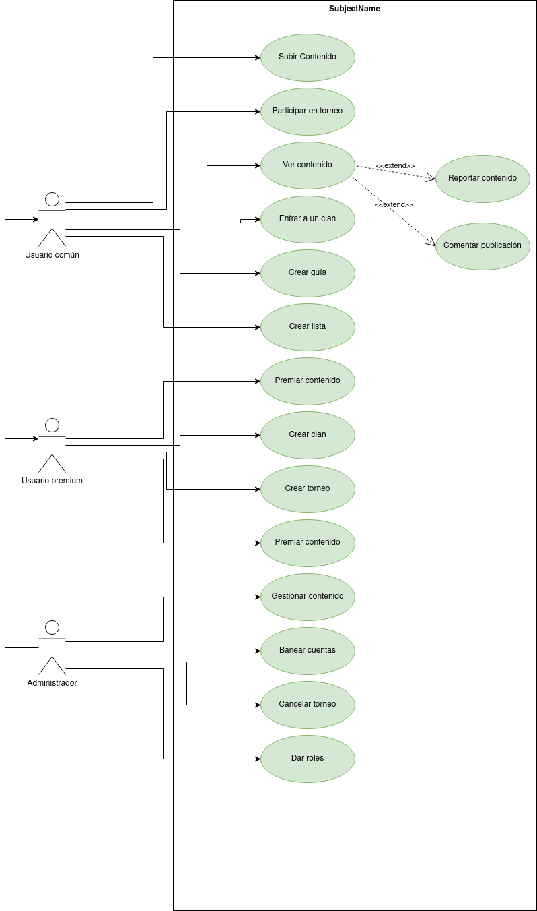

# aplicacion-resumen-warhammer40k
>[!IMPORTANT]
>Este proyecto esta abierto a cambios 
## Definición inicial
Se tratará de una aplicacíon que de un resumen de cada facción dentro del universo de Warhammer 40k, tanto de su historia como su forma de jugar, incluirá tambien las estadisticas de las unidades de cada facción, tambien se podran crear una guia de ejercitos con sus puntos y stats, y un muro donde cada uno podrá subir su ejercito, pedir opiniones o presumir de alguna victoria en mesa, tambien habrá clanes donde se podran organizar torneos. 

## Especificación de Actores y Operaciones
### Actores
1. **Usuario común**: Usuario con una cuenta en la aplicacion que puede usarla casi en su totalidad, tiene unos pequeños limitadores.
2. **Usuario premium**: Usuario con una cuenta que paga una suscripción y puede usar la aplicación sin los limites de un usuario común.
3. **Administrador**: Un usuario que encargado de moderar que la aplicación no se use de forma indevida y que la comunidad se trate con respeto.

### Casos de uso
#### Usuario común
* **Subir contenido a el muro de la plataforma**: El usuario sube una publicacion a la plataforma, puede ser texto, foto o video.
* **Participar en torneo**: El usuario participa en los torneos creados.
* **Reportar contenido**: Avisa a los administradores de que una publicación no podria ser adecuada. 
* **Comentar publicacion**: Puede comentar en el contenido subido por otros usuarios.
* **Ver contenido**: Puede ver el contenido creado por usuarios, ya sea publicaciones, guias o listas.

#### Usuario premium
* **Crear un clan**: Crea un clan al que el resto de usuarios pueden entrar.
* **Crear un torneo**: Crea un torneo en el que pueden participar otros usuarios.
* **Crear guia**: Puede crear guias sin limites para ayudar a otros usuarios.
* **Crear listas:**: Puede crear listas de ejercito sin limite, donde se ve como haría los distintos ejercito del juego de mesa.
* **Premiar contenido**: Da me gustas y premios simbolicos especiales a las publicaciones de otros usuarios.

#### Administrador
* **Gestionar contenido**: Puede borrar o recuperar publicaciones.
* **Banear cuentas**: Borra o bloqua una cuenta que ya haya subido muchas publicaciones que sean hirientes sensibles o por haber tenido un mal comportamiento de forma continuada.
* **Cancelar torneo**: Si un torneo esta teniendo un comportamiento inadecuado o toxico puede cancelarlo en el acto.
* **Dar roles**: Si hay un usuario destacado puede darle un roll como premio.
## Diagrama de casos de uso

### Actores
#### Usuario común
|  Actor | Usuario Común |
|---|---|
| Descripción  | _Usuario normal de la aplicación_  |
| Características  |_Usa la aplicación de forma gratuita_ |
| Relaciones | __  |
| Referencias | _Subir contenido, participar en torneo, ver contenido, entrar a un clan, crear guía, crear lista_ |   
|  Notas |  __ |
| Autor  | _Alejandro Salazar González_ |
|Fecha | _12/11/2024_ |

|  Atributo |||
|---|---|---|
| _Nombre_  | _Descripción_  | _Tipo_ |
| | |
#### Usuario premium
|  Actor | Usuario Premium |
|---|---|
| Descripción  | _Usuario ue paga una suscripcion a la aplicación_  |
| Características  |_Usa la aplicación pagando_ |
| Relaciones | __  |
| Referencias | _Subir contenido, participar en torneo, ver contenido, entrar a un clan, crear guía, crear lista, premiar contenido, crear clan, crear torneo_ |   
|  Notas |  __ |
| Autor  | _Alejandro Salazar González_ |
|Fecha | _12/11/2024_ |

|  Atributo |||
|---|---|---|
| _Nombre_  | _Descripción_  | _Tipo_ |
| | |

#### Administrador
|  Actor | Administrador |
|---|---|
| Descripción  | _Administrador de la aplicción_  |
| Características  |_Usa la aplicación sin restricciones_ |
| Relaciones | __  |
| Referencias | _Subir contenido, participar en torneo, ver contenido, entrar a un clan, crear guía, crear lista, premiar contenido, crear clan, crear torneo, gestionar contenido, banear cuentas, cancelar torneo, dar roles_ |   
|  Notas |  __ |
| Autor  | _Alejandro Salazar González_ |
|Fecha | _12/11/2024_ |

|  Atributo |||
|---|---|---|
| _Nombre_  | _Descripción_  | _Tipo_ |
| | |
### Casos de uso
#### Subir contenido
|  Caso de Uso	CU | Subir Contenido  |
  |---|---|
  | Fuentes  | _[Documento]()_  |
  | Actor  |  _Usuario comun, Usuario premium, Administrador_ |
  | Descripción | _Sube una publicación a la aplicación_  |
  | Flujo básico | __ |
  | Pre-condiciones | _Estar dentro de la aplicación_  |  
  | Post-condiciones  | _La publicación debe cumplir con las normas de la aplicación_  |  
  |  Requerimientos | _El usuario debe de tener una cuenta_  |
  |  Notas |  __ |
  | Autor  | _Alejandro Salazar González_ |
  |Fecha | _12/11/2024_ |
#### Ver contenido
|  Caso de Uso	CU | Ver Contenido  |
  |---|---|
  | Fuentes  | _[Documento]()_  |
  | Actor  |  _Usuario comun, Usuario premium, Administrador_ |
  | Descripción | _Mira publicaciones en aplicación_  |
  | Flujo básico | __ |
  | Pre-condiciones | _Estar dentro de la aplicación_  |  
  | Post-condiciones  | __  |  
  |  Requerimientos | _El usuario debe de tener una cuenta_  |
  |  Notas |  __ |
  | Autor  | _Alejandro Salazar González_ |
  |Fecha | _12/11/2024_ |
#### Reportar contenido
|  Caso de Uso	CU | Reportar Contenido  |
  |---|---|
  | Fuentes  | _[Documento]()_  |
  | Actor  |  _Usuario comun, Usuario premium, Administrador_ |
  | Descripción | _Reporta una publicación a la aplicación_  |
  | Flujo básico | _Entra a la aplicion, ve un contenido inadecuado, lo reporta_ |
  | Pre-condiciones | _Estar dentro de la aplicación_  |  
  | Post-condiciones  | __  |  
  |  Requerimientos | _El usuario debe de tener una cuenta_  |
  |  Notas |  __ |
  | Autor  | _Alejandro Salazar González_ |
  |Fecha | _12/11/2024_ |
#### Comentar publicación
|  Caso de Uso	CU | Comentar Contenido  |
  |---|---|
  | Fuentes  | _[Documento]()_  |
  | Actor  |  _Usuario comun, Usuario premium, Administrador_ |
  | Descripción | _Comenta en una publicación a la aplicación_  |
  | Flujo básico | _Entra aplicacion, ve el contenido, comenta_ |
  | Pre-condiciones | _Estar dentro de la aplicación_  |  
  | Post-condiciones  | __  |  
  |  Requerimientos | _El usuario debe de tener una cuenta_  |
  |  Notas |  __ |
  | Autor  | _Alejandro Salazar González_ |
  |Fecha | _12/11/2024_ |
#### 